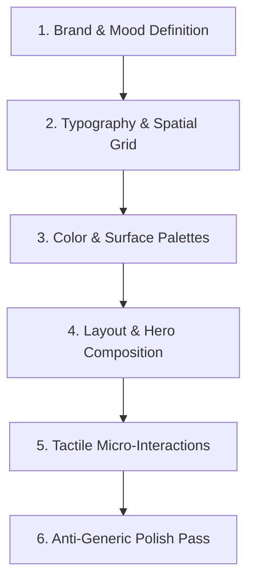

# Frontend Design Skill: Production-Grade & Anti-Generic UI

This skill guides the design and implementation of distinctive, polished, production-grade frontend interfaces that break away from repetitive AI boilerplate styles.

---

## 1. Principles of High-End Frontend Design

1. **Avoid the "Generic AI Aesthetic"**:
   - Do not rely on cliché centered card layouts with uniform purple/indigo gradients and flat gray backgrounds.
   - Inject distinct personality tailored to the domain: industrial, editorial, minimal Swiss, cyberpunk, organic, luxury, or playful.

2. **Intentional Visual Hierarchy**:
   - Guide the user's eye naturally through scale, contrast, weight, and negative space.
   - The most important action or data point must stand out in under 3 seconds.

3. **Layered Depth & Texture**:
   - Move beyond flat solid boxes. Use multi-layered borders (e.g. `ring-1 ring-white/10` + `border border-slate-800`), glassmorphic blur, subtle radial mesh gradients, and fine inner shadows.

4. **Micro-Interactions & Tactile Feedback**:
   - Provide crisp, responsive feedback for every click, hover, toggle, and drag.
   - Use spring physics and ease-out curves instead of linear or abrupt transitions.

---

## 2. Design Process Runbook



### Step 1: Establish Mood & Style Archetype
- Determine the visual theme:
  - **SaaS / Dashboard**: High information density, subtle borders, crisp monospaced numbers, muted slate/zinc backgrounds with vibrant accent badges.
  - **Consumer / Mobile**: Warm organic gradients, generous padding, pill chips, fluid animations.
  - **Editorial / Content**: Expressive serif headers, spacious columns, high typographic contrast.

### Step 2: Craft the Layout
- Use asymmetric grids, split layouts, sticky floating panels, or sidebar docks rather than centered single-column stacks.
- Add generous, deliberate whitespace around key focal points.

### Step 3: Implement Rich Surfaces
- Compose background ambient lighting with subtle SVG radial gradients or blur spheres:
  ```html
  <div class="absolute inset-0 -z-10 overflow-hidden">
    <div class="absolute -top-40 -right-40 w-96 h-96 rounded-full bg-primary-500/10 blur-3xl pointer-events-none"></div>
    <div class="absolute -bottom-40 -left-40 w-96 h-96 rounded-full bg-accent-500/10 blur-3xl pointer-events-none"></div>
  </div>
  ```

---

## 3. Sub-Documentation & Reference Guides

- **[Anti-Generic UI Rules](references/anti_generic_rules.md)**: Concrete dos and don'ts to eliminate generic AI templates, boilerplate cards, and cookie-cutter styles.
- **[Visual Hierarchy & Composition](references/visual_hierarchy.md)**: Techniques for focal points, optical alignment, typography contrasts, and surface layering.
