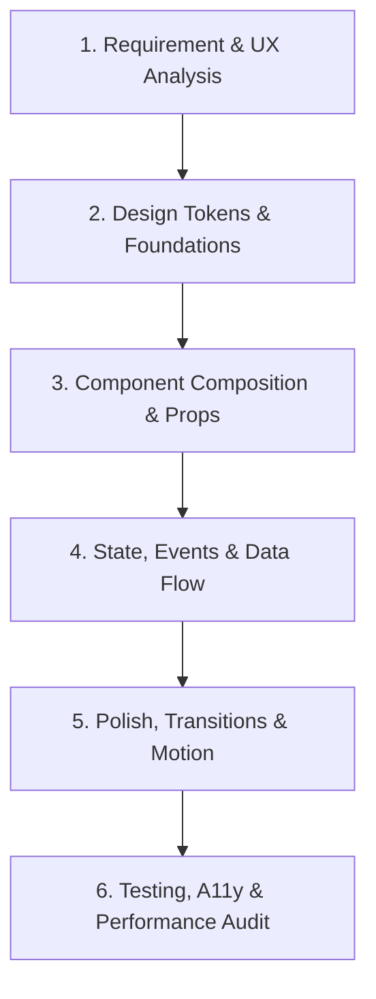

# Frontend Developer Skill & Runbook

This skill equips the agent with expert-level frontend development capabilities, spanning UI/UX design principles, modern component architecture, responsive styling, state management, performance optimization, and accessibility standards.

---

## 1. Core Principles & Philosophy

1. **Visual Excellence & Wow-Factor**:
   - Modern, polished interfaces using curated color palettes, elegant typography, subtle depth (glassmorphism/shadows), and smooth transitions.
   - Eliminate generic, bare-bones UI. Avoid default unstyled browser elements or raw primary colors.

2. **Component-Driven Architecture**:
   - Build modular, single-responsibility components with strict TypeScript types.
   - Follow Atomic / Compound design patterns for complex UI elements (buttons, inputs, dialogs, dropdowns).

3. **Responsive & Mobile-First**:
   - Design fluid layouts that look flawless across all screen sizes (mobile, tablet, desktop, ultra-wide).
   - Leverage CSS Grid, Flexbox, and Tailwind responsive breakpoints (`sm`, `md`, `lg`, `xl`, `2xl`).

4. **Performance by Default**:
   - Minimize bundle size, eliminate unnecessary re-renders, lazy-load heavy components/routes, and optimize Core Web Vitals (LCP, INP, CLS).

5. **Accessibility (a11y) & Inclusivity**:
   - Ensure WCAG 2.1 AA compliance: semantic HTML, proper contrast ratios, keyboard navigation, visible focus indicators, and ARIA attributes where needed.

---

## 2. Frontend Development Workflow

Follow this step-by-step procedure when implementing frontend features:

### Phase 1: Requirement & UX Analysis
- Clarify user personas, key user journeys, edge cases, and viewport targets.
- Identify required states: `idle`, `loading`, `empty`, `error`, `success`, `hover`, `active`, `disabled`.

### Phase 2: Design Tokens & Foundations
- Define CSS custom properties or Tailwind themes for:
  - **Colors**: Primary, secondary, neutral, semantic (success, warning, error, info), and surface backgrounds.
  - **Typography**: Font family, font sizes, line heights, font weights.
  - **Spacing & Radii**: Consistent padding/margin scales (4px grid) and border-radius tokens.

### Phase 3: Component Implementation
- Break UI into clean, reusable primitives.
- Use TypeScript interfaces with strict prop typings and JSDoc documentation.
- Implement accessible HTML tags (`<main>`, `<nav>`, `<header>`, `<article>`, `<button>`).

### Phase 4: State Management & Data Flow
- Keep state as local as possible. Lift state up only when necessary.
- Use custom hooks to isolate business logic, side effects, and API calls from rendering.
- Ensure proper optimistic updates, loading skeletons, and error handling boundaries.

### Phase 5: Styling, Motion & Polish
- Apply utility classes (Tailwind CSS) or CSS Modules with structured class composition (e.g., `cn()` / `clsx` + `tailwind-merge`).
- Integrate micro-interactions (hover, active, focus-visible) and smooth entry/exit animations (Framer Motion).

### Phase 6: Verification & Auditing
- Verify layout responsiveness across breakpoints.
- Test keyboard navigation (Tab, Shift+Tab, Enter, Space, Escape, Arrow keys).
- Audit contrast, Lighthouse scores, and console warnings/errors.

---

## 3. Sub-Documentation & References

For in-depth guides and code patterns, refer to the following reference documents:

- **[Design System & Visual Foundations](references/design_system.md)**: Color theory, typography scales, glassmorphism, dark mode theming, and layout grids.
- **[Component Architecture & React Patterns](references/component_patterns.md)**: Modern React/TypeScript patterns, custom hooks, compound components, and form validation.
- **[Styling, Layouts & Animations](references/styling_and_animations.md)**: Tailwind CSS patterns, CSS Grid/Flexbox blueprints, Framer Motion recipes, and micro-interactions.
- **[Performance & Accessibility (a11y)](references/performance_and_a11y.md)**: Web Vitals optimization, React memoization, WCAG 2.1 AA checklist, and ARIA guides.

---

## 4. Frontend Developer Quality Checklist

Before completing any frontend task, verify the following:

- [ ] **Visual Appeal**: High-contrast, clean hierarchy, cohesive spacing, modern aesthetic.
- [ ] **Responsiveness**: Tested on mobile (375px), tablet (768px), and desktop (1280px+).
- [ ] **Empty/Loading/Error States**: Graceful fallback UI, skeleton loaders, and meaningful error messages.
- [ ] **Keyboard & Focus**: All interactive elements are reachable via keyboard with visible `:focus-visible` outlines.
- [ ] **Semantic HTML**: Proper heading structure (`h1` -> `h2` -> `h3`), semantic landmarks, and button tags for actions.
- [ ] **Code Cleanliness**: No inline hardcoded styles, unused imports, or `any` types in TypeScript.
