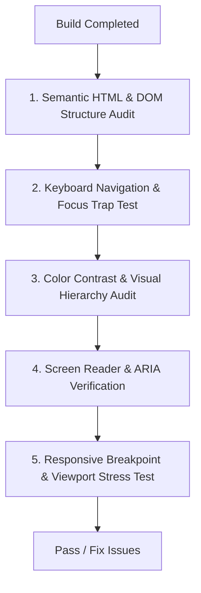

# Web Design Guidelines & Post-Build Audit Skill

This skill provides an exhaustive inspection checklist and remediation procedures to run after building any frontend view, ensuring zero accessibility defects, pristine semantic HTML, full keyboard navigation, and flawless visual polish.

---

## 1. Post-Build Audit Pipeline

Run this sequence systematically whenever reviewing or finishing a frontend view:

---

## 2. Core Audit Categories

### 1. Semantic HTML & Headings
- Only **one** `<h1>` per page.
- Headings never jump levels (e.g. `<h1>` -> `<h2>` -> `<h3>`).
- Interactive elements use real `<button>` or `<a>` tags, never `
`.

### 2. Full Keyboard Navigation
- Tab order follows the visual flow naturally from top-left to bottom-right.
- Focus outlines are visible (`:focus-visible`) and not stripped with `outline: none` unless replaced with a distinct focus ring.
- Modals trap focus and allow closing with `Escape`.

### 3. Screen Reader & ARIA
- Every icon button has an accessible name via `aria-label` or visually hidden text.
- Images have meaningful `alt` text (or `alt=""` for decorative icons).
- Form inputs have associated `<label htmlFor="...">` elements or `aria-labelledby`.

### 4. Responsive & Edge Viewports
- Layout tested at 375px (mobile), 768px (tablet), 1280px (desktop), and 1920px+ (wide).
- No horizontal page scrollbars on mobile (`overflow-x: hidden` / properly constrained grid/flex containers).
- Dynamic text does not overflow or truncate awkwardly with long strings.

---

## 3. Sub-Documentation & Reference Guides

- **[Accessibility & Keyboard Audit Checklist](references/a11y_audit_checklist.md)**: WCAG 2.1 AA checklist, focus management, ARIA patterns, and screen reader testing.
- **[Semantic HTML & SEO Quality Audit](references/semantic_and_seo_audit.md)**: HTML5 landmarks, metadata tags, heading structure, and layout shift prevention.
